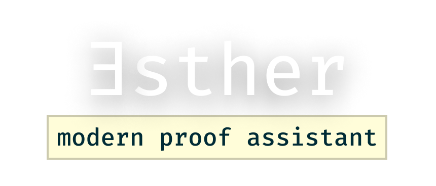

Esther is a work-in-progress, proof-of-concept automated theorem proof
assistant based on homotopy type theory (similar to [Lean] and [Arend].)

[lean]: https://github.com/leanprover/lean4
[arend]: https://github.com/JetBrains/Arend
